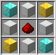

# Auto Excavator
## 使い方
### とりあえず採掘
採掘機をクラフトして設置する

### アップグレード
動作中の採掘機のスロットにアップグレードアイテムを入れる (アップグレードアイテムは採掘機を破壊したときに返却される)

## レシピ
### 基本自動採掘機

### 発展自動採掘機

### 精鋭自動採掘機

### 究極自動採掘機

### アップグレード: 幸運

### アップグレード: シルクタッチ

